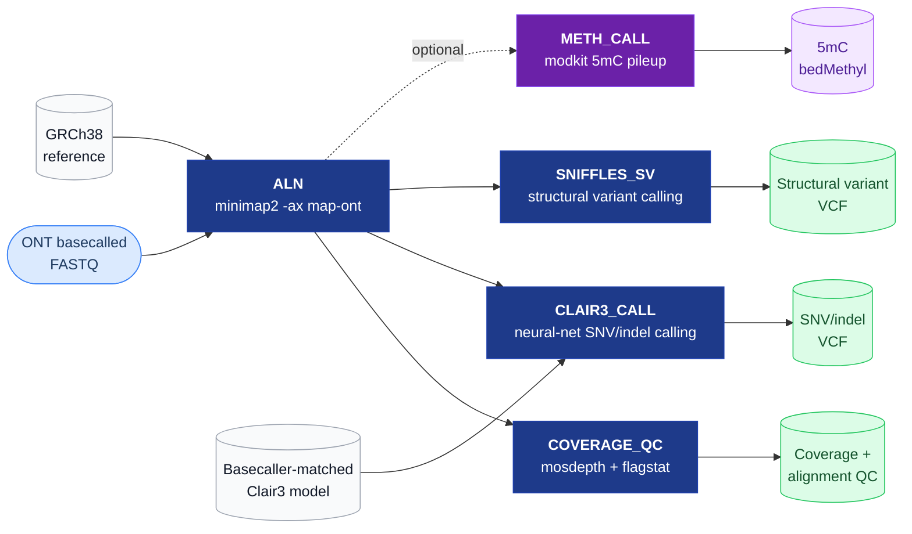

# ONT WGS Pipeline

<em>Oxford Nanopore long-read germline whole-genome sequencing: variants, structural variants, and native methylation.</em>

  
  &nbsp;
  
  &nbsp;
  
  &nbsp;
  
  &nbsp;
  

  <a href="#pipeline">Pipeline</a> &nbsp;•&nbsp;
  <a href="#why-clair3--sniffles2-instead-of-the-short-read-sentiongatk-stack">Why long-read tools</a> &nbsp;•&nbsp;
  <a href="#infrastructure">Infrastructure</a> &nbsp;•&nbsp;
  <a href="#requirements">Requirements</a> &nbsp;•&nbsp;
  <a href="#scope-note">Scope</a>

---

One alignment, three parallel calls: a neural-network SNV/indel caller, a structural-variant
caller built for long-read span, and an optional native-methylation pileup straight from the
basecalled signal — no separate bisulfite prep required.

## Pipeline

1. **ALN** — [minimap2](https://github.com/lh3/minimap2) alignment (`-ax map-ont`) against
   GRCh38, sorted and indexed with samtools.
2. **COVERAGE_QC** — [mosdepth](https://github.com/brentp/mosdepth) coverage summary and
   `samtools flagstat` alignment QC.
3. **CLAIR3_CALL** — [Clair3](https://github.com/HKU-BAL/Clair3) SNV/indel calling, using a
   basecaller-model-matched Clair3 model (accuracy depends on matching the model to the actual
   basecaller chemistry/model used — see `downloads/`).
4. **SNIFFLES_SV** — [Sniffles2](https://github.com/fritzsedlazeck/Sniffles) structural-variant
   calling, taking advantage of long-read span for SVs short reads can't resolve directly.
5. **METH_CALL** *(optional, `params.call_methylation = true`)* —
   [modkit](https://github.com/nanoporetech/modkit) 5mC methylation pileup from basecalled
   modified-base BAM tags — native methylation detection without a separate bisulfite prep,
   which is one of ONT's specific advantages over short-read WGBS.

## Why Clair3 + Sniffles2 instead of the short-read (Sentieon/GATK) stack

Short-read germline calling (see [`wgs-pipeline`](https://github.com/ankurgenomics/wgs-pipeline))
uses BQSR + Haplotyper, which assume short, high base-quality reads. ONT reads are long
(often 10-100kb+) with a different, more structured error profile, so variant calling needs a
model trained specifically on that signal — Clair3's neural-network caller — rather than a
BQSR-style base-quality recalibration step. Structural variants are also directly detectable
from long-read spanning alignments in a way short reads can only approximate through
paired-end/split-read inference, which is why SV calling is a first-class step here rather than
an afterthought.

## Infrastructure

`workflow/nextflow.config` ships a `cloud` profile targeting **AWS Batch**: spot-priced queue
tiers (`med`/`lg`/`xl`, matched to each process's `label`), an S3-backed work directory, and
automatic per-run HTML execution report, trace, and timeline output from Nextflow itself. A
`docker` profile and a `standard` (local) profile are also provided. Fill in your own S3 bucket
names, AWS Batch queue names, region, and the Clair3 model matching your basecaller chemistry in
the placeholders marked `<your-...>` before running.

## Requirements

| | |
|---|---|
| Workflow engine | [Nextflow](https://www.nextflow.io/) 22.x+ (DSL2) |
| Alignment | [minimap2](https://github.com/lh3/minimap2), [samtools](https://www.htslib.org/) |
| SNV/indel calling | [Clair3](https://github.com/HKU-BAL/Clair3) + a model matched to your basecaller (`downloads/` fetches one from ONT's `rerio` model repo) |
| SV calling | [Sniffles2](https://github.com/fritzsedlazeck/Sniffles) |
| Coverage QC | [mosdepth](https://github.com/brentp/mosdepth) |
| Methylation (optional) | [modkit](https://github.com/nanoporetech/modkit) |
| Containers | Docker (or Singularity) |
| Cloud | AWS CLI + Batch compute environment, if running the `cloud` profile |

## Scope note

This is a from-scratch germline SNV/SV/methylation pipeline built around the standard,
permissively-licensed ONT open-source tool ecosystem (minimap2, Clair3, Sniffles2, mosdepth,
modkit) — it is not a fork or reproduction of any vendor pipeline (e.g. ONT/EPI2ME Labs'
`wf-human-variation`), which ships under Oxford Nanopore's own public license with usage
restrictions. Phasing (WhatsHap), joint/cohort calling, and somatic calling are not yet included
and would follow the same pattern.

## License

MIT — see [LICENSE](LICENSE). (Note: this license covers the pipeline code in this repository
only. The third-party tools it invokes — minimap2, Clair3, Sniffles2, mosdepth, modkit — each
carry their own separate licenses; check those before commercial use.)
